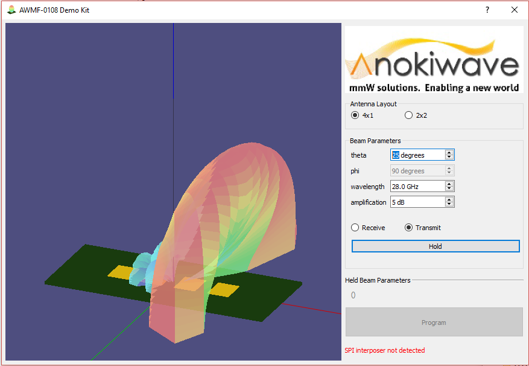

# Anokiwave system demo

The purpose of this code is to visualize the radiation patterns achieveable with
our beamforming system and then to program the system accordingly
 directly from a laptop.

run with `python3 BeamDemo.py`

## Dependencies
Required the following python3 modules:
 - yaml
 - PyQt5
    - I installed this with pip3 and a downloaded binary. See instructions [here](http://pyqt.sourceforge.net/Docs/PyQt5/installation.html)
  PyOpenGL

Sending out physical commands on the wire through the SPI interposer hardware requires the ni8452's drivers to be installed on your computer and available on your PATH.
That's only been tested on windows.
The beam patterns and GUI should run OK without it though.

## preview

